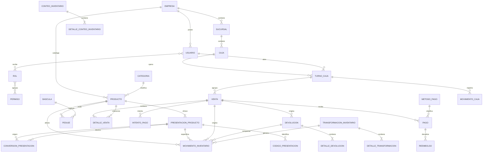

# Especificación funcional del MVP — Sistema de punto de venta

**Versión:** 0.2  
**Fecha:** 4 de agosto de 2026  
**Estado:** Borrador para revisión funcional  
**Propósito:** Definir qué debe resolver el primer producto antes de seleccionar arquitectura, framework o diseño definitivo de base de datos.

---

## 1. Contexto

El negocio requiere un sistema que permita registrar las ventas de manera rápida y confiable, conservar una base sólida de productos, identificar a las personas que realizan y autorizan operaciones, y producir información suficiente para realizar arqueos de dinero y mercancía.

Aunque el producto podría evolucionar a un SaaS, el primer MVP se validará con la operación real del negocio familiar. La prioridad es construir un registro histórico correcto y una experiencia de venta fácil de aprender.

## 2. Objetivos

### 2.1 Objetivo principal

Permitir que un empleado capacitado pueda registrar una venta completa, asociar sus pagos, afectar las existencias, emitir un comprobante y dejar una trazabilidad auditable de la operación.

### 2.2 Objetivos específicos

1. Mantener un catálogo confiable de productos, categorías, códigos y precios.
2. Registrar todas las ventas y sus detalles históricos.
3. Identificar quién realizó, registró y, cuando corresponda, autorizó cada operación.
4. Manejar usuarios mediante roles y permisos.
5. Registrar pagos en efectivo, Mercado Pago manual y otros métodos configurables.
6. Controlar aperturas, movimientos y cierres básicos de caja.
7. Registrar movimientos básicos de inventario para explicar la existencia teórica.
8. Controlar productos por pieza, peso o volumen usando unidades consistentes.
9. Diferenciar empaques cerrados de unidades sueltas y registrar su transformación.
10. Evitar duplicados y pérdida de operaciones ante reintentos o fallas.
11. Dejar preparada la evolución hacia pagos integrados, operación sin internet, compras, proveedores e inventario avanzado.

## 3. Criterios iniciales de éxito

Los valores deberán validarse durante el piloto.

1. Un empleado nuevo puede completar una venta normal después de una capacitación breve.
2. Una venta normal puede realizarse desde una sola pantalla operativa.
3. Toda venta completada puede reconstruirse: productos, cantidades, precios, pagos, usuario, caja, turno y fechas.
4. Ninguna venta o movimiento confirmado se elimina físicamente para corregir un error.
5. Un reintento técnico no produce una segunda venta ni un segundo cobro.
6. El cierre de turno explica el efectivo esperado, el efectivo contado y su diferencia.
7. La existencia de un producto puede explicarse mediante sus movimientos.
8. Una venta por peso conserva exactamente la cantidad neta utilizada para cobrar.
9. La apertura de una caja puede explicar cuántas unidades sueltas se generaron y cuál fue su costo.

## 4. Prioridades

- **MVP:** indispensable para operar el primer piloto.
- **Siguiente:** extensión prioritaria una vez estable el MVP.
- **Futuro:** fuera del primer alcance, pero contemplado en el modelo.
- **Por decidir:** necesita una decisión de negocio o validación técnica.

## 5. Alcance

### 5.1 Incluido en el MVP

- Inicio y cierre de sesión.
- Usuarios, roles y permisos.
- Empresa, sucursal, caja y dispositivo básicos.
- Categorías, productos, códigos de barras, unidad, precio y costo de referencia.
- Productos discretos, por peso y por volumen.
- Presentaciones comprables y vendibles, por ejemplo caja cerrada y unidad suelta.
- Conversiones fijas entre presentaciones y apertura controlada de empaques.
- Captura de peso neto para productos a granel.
- Creación, consulta y desactivación de productos.
- Venta mediante carrito.
- Detalles históricos de la venta.
- Uno o varios pagos por venta.
- Efectivo, Mercado Pago registrado manualmente y otros métodos configurables.
- Cancelación de cobros pendientes.
- Devolución o reversión de ventas completadas con autorización.
- Apertura y cierre de turno.
- Movimientos básicos de caja.
- Inventario básico: existencia inicial, salida por venta, devolución, transformación, merma y ajuste.
- Conteo físico básico para productos de cantidad variable.
- Reportes operativos básicos.
- Auditoría de operaciones relevantes.

### 5.2 Siguiente versión

- Integración directa con una terminal Mercado Pago Point mediante API.
- Integración directa con una báscula comercial mediante conector local.
- Operación sin internet y sincronización posterior.
- Clientes e historial de compra.
- Descuentos, promociones y autorizaciones por límite.
- Compras y recepción de mercancía.
- Proveedores.
- Conteos físicos generales y programación periódica.
- Impresión avanzada y plantillas de tickets.

### 5.3 Fuera del MVP

- Lotes, caducidades, FIFO y FEFO.
- Transferencias entre sucursales o almacenes.
- Pronósticos de demanda.
- Sugerencias automáticas de compra.
- Programa de puntos o recompensas.
- Rentabilidad avanzada por cliente.
- Cuentas por pagar.
- Facturación fiscal o contable.
- Suscripciones y facturación del SaaS.
- Aplicación móvil para clientes.

## 6. Actores

| Actor | Descripción |
|---|---|
| Vendedor | Registra y cobra ventas durante su turno. |
| Encargado | Supervisa la operación, autoriza excepciones y resuelve errores cotidianos. |
| Administrador del negocio | Configura productos, usuarios, permisos y consulta información sensible. |
| Auditor | Consulta reportes y trazabilidad sin modificar la operación. |
| Administrador de plataforma | Administra el SaaS. Es un rol futuro y separado de los usuarios del negocio. |
| Sistema | Calcula totales, registra movimientos, sincroniza y ejecuta controles automáticos. |
| Mercado Pago | Procesador externo de pagos; en el MVP se registra manualmente y después podrá integrarse. |

### 6.1 Asignación inicial sugerida

- Mamá: administradora operativa o encargada principal.
- Papá: administrador del negocio o encargado, según las tareas reales.
- Responsable técnico: administrador del negocio y, en el futuro, administrador de plataforma.
- Empleados: vendedor.

Cada persona deberá tener una cuenta individual. No se usarán cuentas ni contraseñas compartidas.

## 7. Roles y permisos

Los roles serán conjuntos configurables de permisos. La autorización final deberá verificarse por permiso, no solamente por el nombre del rol.

| Acción | Vendedor | Encargado | Administrador | Auditor |
|---|:---:|:---:|:---:|:---:|
| Iniciar turno | Sí | Sí | Sí | No |
| Registrar venta | Sí | Sí | Sí | No |
| Modificar carrito abierto | Sí | Sí | Sí | No |
| Capturar peso desde báscula | Sí | Sí | Sí | No |
| Capturar peso manualmente por contingencia | Por decidir | Sí | Sí | No |
| Abrir un empaque con conversión configurada | Sí | Sí | Sí | No |
| Registrar contenido distinto al esperado al abrir | No | Sí | Sí | No |
| Cancelar intento de cobro pendiente | Sí | Sí | Sí | No |
| Aplicar descuento dentro de su límite | Por decidir | Sí | Sí | No |
| Autorizar descuento excepcional | No | Sí | Sí | No |
| Devolver venta del turno actual | No | Sí | Sí | No |
| Devolver venta de un turno cerrado | No | Por decidir | Sí | No |
| Realizar ajuste de inventario | No | Sí | Sí | No |
| Autorizar ajuste de inventario | No | Por decidir | Sí | No |
| Abrir y cerrar su turno | Sí | Sí | Sí | No |
| Autorizar diferencia de caja | No | Sí | Sí | No |
| Administrar productos | No | Sí | Sí | No |
| Cambiar precios | No | Por decidir | Sí | No |
| Administrar usuarios y permisos | No | No | Sí | No |
| Consultar reportes sensibles | No | Sí | Sí | Sí |
| Consultar auditoría | No | Por decidir | Sí | Sí |

## 8. Requerimientos funcionales

### 8.1 Organización, sucursales y aislamiento

| ID | Prioridad | Requerimiento |
|---|---|---|
| RF-ORG-001 | MVP | Toda información operativa deberá pertenecer a una empresa. |
| RF-ORG-002 | MVP | Una empresa deberá tener al menos una sucursal. |
| RF-ORG-003 | MVP | Cada venta deberá identificar empresa, sucursal y caja. |
| RF-ORG-004 | MVP | Ningún usuario podrá consultar o modificar datos de otra empresa. |
| RF-ORG-005 | Siguiente | Una empresa podrá operar múltiples sucursales y cajas. |

### 8.2 Usuarios, autenticación y permisos

| ID | Prioridad | Requerimiento |
|---|---|---|
| RF-USR-001 | MVP | El sistema deberá autenticar al usuario antes de permitir operaciones. |
| RF-USR-002 | MVP | Cada usuario deberá tener una identidad individual y un estado activo o inactivo. |
| RF-USR-003 | MVP | Un administrador podrá crear, editar, desactivar y reactivar usuarios. |
| RF-USR-004 | MVP | Los usuarios con historial no se eliminarán físicamente. |
| RF-USR-005 | MVP | El acceso a cada operación se validará mediante permisos. |
| RF-USR-006 | MVP | El sistema registrará el usuario que ejecutó cada operación relevante. |
| RF-USR-007 | MVP | Cuando una operación necesite autorización, se registrarán por separado ejecutor y autorizador. |
| RF-USR-008 | MVP | El sistema permitirá cerrar una sesión y bloquear el punto de venta sin cerrar el turno. |
| RF-USR-009 | Siguiente | Se podrán definir límites por usuario, por ejemplo, porcentaje máximo de descuento. |

### 8.3 Productos

| ID | Prioridad | Requerimiento |
|---|---|---|
| RF-PRD-001 | MVP | Un usuario autorizado podrá crear y editar productos. |
| RF-PRD-002 | MVP | Cada producto tendrá un identificador interno inmutable. |
| RF-PRD-003 | MVP | Cada producto tendrá nombre, categoría, unidad, estado y precio de venta. |
| RF-PRD-004 | MVP | El SKU, cuando exista, será único dentro de la empresa. |
| RF-PRD-005 | MVP | Un producto podrá tener uno o varios códigos de barras. |
| RF-PRD-006 | MVP | Un código de barras no podrá identificar dos productos activos de la misma empresa. |
| RF-PRD-007 | MVP | El producto podrá guardar un costo de referencia para análisis posterior. |
| RF-PRD-008 | MVP | Los productos usados en operaciones históricas no se eliminarán; se desactivarán. |
| RF-PRD-009 | MVP | Se podrán buscar productos por nombre, SKU o código de barras. |
| RF-PRD-010 | MVP | El sistema conservará quién y cuándo creó o modificó un producto. |
| RF-PRD-011 | Siguiente | Se conservará un historial formal de cambios de precio y costo. |
| RF-PRD-012 | MVP | El sistema permitirá productos discretos y productos vendidos por cantidades variables, por ejemplo gramos o mililitros. |
| RF-PRD-013 | MVP | Cada producto tendrá un tipo de control: pieza, peso o volumen. |
| RF-PRD-014 | MVP | Cada producto tendrá una unidad base de inventario y una unidad de precio compatibles. |
| RF-PRD-015 | MVP | Un producto podrá tener una o varias presentaciones, por ejemplo caja, paquete o unidad. |
| RF-PRD-016 | MVP | Cada presentación indicará si es comprable, vendible y susceptible de apertura. |
| RF-PRD-017 | MVP | Cada presentación podrá tener SKU, código de barras, precio y costo propios. |
| RF-PRD-018 | MVP | Se podrán configurar conversiones fijas entre presentaciones, por ejemplo una caja equivalente a doce unidades. |
| RF-PRD-019 | MVP | Las cantidades de pieza no admitirán fracciones salvo configuración explícita. |
| RF-PRD-020 | MVP | Los productos medidos respetarán el incremento o resolución configurada para su unidad. |

### 8.4 Venta

| ID | Prioridad | Requerimiento |
|---|---|---|
| RF-VTA-001 | MVP | Un vendedor con turno abierto podrá iniciar una venta. |
| RF-VTA-002 | MVP | Una venta comenzará en estado borrador. |
| RF-VTA-003 | MVP | Se podrán agregar productos escaneando código de barras o mediante búsqueda. |
| RF-VTA-004 | MVP | El vendedor podrá modificar o eliminar partidas mientras la venta sea borrador. |
| RF-VTA-005 | MVP | El sistema calculará subtotal, descuentos, impuestos si aplican, total pagado, saldo y cambio. |
| RF-VTA-006 | MVP | Cada detalle guardará una copia histórica de producto, SKU, cantidad, precio, costo, descuento, impuesto y total. |
| RF-VTA-007 | MVP | La venta identificará al vendedor, usuario registrador, caja, turno, sucursal y dispositivo. |
| RF-VTA-008 | MVP | Cada venta tendrá un identificador global y un folio legible único dentro del ámbito definido. |
| RF-VTA-009 | MVP | Una venta sólo podrá completarse cuando su condición de pago sea válida. |
| RF-VTA-010 | MVP | Completar una venta registrará de forma consistente la venta, pagos, movimientos de caja e inventario. |
| RF-VTA-011 | MVP | Una venta completada no podrá editarse ni eliminarse. |
| RF-VTA-012 | MVP | Se podrá consultar una venta por folio, fecha o usuario. |
| RF-VTA-013 | MVP | El sistema podrá generar un comprobante o ticket no fiscal. |
| RF-VTA-014 | MVP | El sistema evitará completar dos veces la misma venta por doble clic o reintento. |
| RF-VTA-015 | Siguiente | Se podrán suspender y recuperar ventas abiertas. |
| RF-VTA-016 | Siguiente | Se podrá asociar opcionalmente un cliente a una venta. |
| RF-VTA-017 | MVP | Si no existen unidades sueltas pero hay empaques abribles disponibles, el sistema podrá ofrecer abrir un empaque desde el flujo de venta. |
| RF-VTA-018 | MVP | Un detalle vendido por peso conservará la cantidad neta, unidad, precio por unidad de referencia y origen de la lectura. |

### 8.5 Pagos

| ID | Prioridad | Requerimiento |
|---|---|---|
| RF-PAG-001 | MVP | Una venta podrá tener uno o varios pagos. |
| RF-PAG-002 | MVP | Los métodos iniciales serán efectivo, Mercado Pago manual y otros configurables. |
| RF-PAG-003 | MVP | Cada pago registrará monto, método, estado, fecha, usuario y referencia externa cuando exista. |
| RF-PAG-004 | MVP | El sistema calculará el cambio de los pagos en efectivo. |
| RF-PAG-005 | MVP | Un pago externo manual requerirá una referencia o confirmación explícita del vendedor. |
| RF-PAG-006 | MVP | Un intento rechazado o incierto no se registrará como pago confirmado. |
| RF-PAG-007 | MVP | Un intento de pago pendiente podrá cancelarse sin cancelar el carrito. |
| RF-PAG-008 | MVP | El sistema deberá distinguir intento de pago, pago confirmado y reembolso. |
| RF-PAG-009 | Siguiente | El backend podrá crear órdenes para una terminal Mercado Pago Point compatible. |
| RF-PAG-010 | Siguiente | El sistema recibirá webhooks y verificará el estado de una orden de Mercado Pago. |
| RF-PAG-011 | Siguiente | Las peticiones externas de cobro, cancelación y reembolso usarán idempotencia. |
| RF-PAG-012 | Siguiente | El sistema podrá conciliar una venta con la orden y pago correspondientes de Mercado Pago. |

### 8.6 Turnos y caja

| ID | Prioridad | Requerimiento |
|---|---|---|
| RF-CAJ-001 | MVP | Para vender, el usuario deberá tener un turno abierto en una caja, salvo configuración contraria. |
| RF-CAJ-002 | MVP | La apertura registrará caja, usuario, fecha y fondo inicial. |
| RF-CAJ-003 | MVP | El sistema registrará movimientos de efectivo por venta, devolución, ingreso, retiro, gasto y ajuste. |
| RF-CAJ-004 | MVP | Todo movimiento manual exigirá tipo, monto, motivo y usuario. |
| RF-CAJ-005 | MVP | Los retiros, gastos y ajustes podrán requerir autorización según su monto o tipo. |
| RF-CAJ-006 | MVP | El cierre registrará efectivo esperado y efectivo contado. |
| RF-CAJ-007 | MVP | El sistema calculará y conservará la diferencia de caja. |
| RF-CAJ-008 | MVP | El cierre mostrará totales por método de pago, ventas, devoluciones y movimientos manuales. |
| RF-CAJ-009 | MVP | Un turno cerrado no podrá reabrirse silenciosamente. Toda corrección posterior será auditable. |
| RF-CAJ-010 | Por decidir | Se definirá si un usuario puede tener más de un turno abierto o cambiar de caja. |
| RF-CAJ-011 | MVP | Cada turno tendrá una fecha operativa para agrupar correctamente las ventas aunque el turno cruce la medianoche. |

### 8.7 Inventario básico

| ID | Prioridad | Requerimiento |
|---|---|---|
| RF-INV-001 | MVP | La existencia teórica se explicará mediante movimientos de inventario. |
| RF-INV-002 | MVP | Los tipos iniciales serán existencia inicial, venta, devolución, transformación, merma y ajuste. |
| RF-INV-003 | MVP | Cada movimiento registrará producto, presentación, unidad, cantidad, sentido, motivo, fecha, usuario y operación origen cuando apliquen. |
| RF-INV-004 | MVP | Completar una venta generará salidas de inventario por sus partidas. |
| RF-INV-005 | MVP | Una devolución válida generará los movimientos compensatorios aplicables. |
| RF-INV-006 | MVP | Un ajuste manual requerirá permiso y motivo. |
| RF-INV-007 | MVP | Los movimientos confirmados no se editarán ni eliminarán. |
| RF-INV-008 | Por decidir | Se definirá si el MVP permite vender con existencia negativa. |
| RF-INV-009 | Futuro | El inventario manejará lotes, caducidades y estrategia FEFO o FIFO. |
| RF-INV-010 | MVP | El saldo podrá consultarse por presentación para diferenciar empaques cerrados de unidades sueltas. |
| RF-INV-011 | MVP | La apertura de un empaque generará una salida de la presentación origen y entradas de la presentación destino. |
| RF-INV-012 | MVP | Una transformación conservará el valor total de inventario salvo merma o diferencia explícita. |
| RF-INV-013 | MVP | Si el contenido real de un empaque difiere del esperado, el sistema exigirá cantidad real y motivo. |
| RF-INV-014 | MVP | La merma conocida se registrará separada de una diferencia encontrada en conteo. |
| RF-INV-015 | MVP | Un conteo físico conservará existencia teórica, cantidad física, diferencia, usuario y autorización cuando aplique. |
| RF-INV-016 | MVP | La existencia de productos por peso se controlará en una unidad base uniforme, por ejemplo gramos. |

### 8.8 Pesaje, presentaciones y transformaciones

| ID | Prioridad | Requerimiento |
|---|---|---|
| RF-MED-001 | MVP | Para productos por peso, el sistema capturará el peso neto mostrado por la báscula después de que el operador haya realizado la tara o puesta en cero en el instrumento. |
| RF-MED-002 | MVP | El POS no calculará ni restará nuevamente la tara cuando la báscula entregue peso neto. |
| RF-MED-003 | MVP | Una lectura guardará cantidad neta, unidad, origen, usuario y fecha. |
| RF-MED-004 | MVP | Cuando el dispositivo lo permita, se conservarán la báscula utilizada y el indicador de lectura estable. |
| RF-MED-005 | MVP | La captura manual de peso será una contingencia identificable y podrá requerir motivo o autorización. |
| RF-MED-006 | MVP | El importe se calculará con cantidad neta, factor de conversión y precio vigente de la presentación. |
| RF-MED-007 | MVP | El sistema no permitirá modificar el pesaje de una venta completada. |
| RF-MED-008 | Siguiente | Un conector local podrá leer una báscula USB o serial mediante un protocolo documentado. |
| RF-MED-009 | Siguiente | El conector local podrá entregar lecturas al POS aun cuando la conexión con el servidor esté temporalmente interrumpida. |
| RF-EMP-001 | MVP | Un usuario autorizado podrá abrir un empaque desde inventario o desde el flujo de venta. |
| RF-EMP-002 | MVP | La apertura mostrará presentación origen, cantidad esperada de unidades y presentación destino. |
| RF-EMP-003 | MVP | La confirmación generará una transformación atómica y auditable. |
| RF-EMP-004 | MVP | Si la cantidad encontrada es distinta de la esperada, se registrará la diferencia como merma o ajuste según su causa. |
| RF-EMP-005 | MVP | El sistema transferirá el costo del empaque a las unidades resultantes usando precisión suficiente. |
| RF-EMP-006 | MVP | La capacidad de vender una presentación se definirá por configuración y no mediante excepciones programadas por marca o categoría. |

### 8.9 Cancelaciones, devoluciones y correcciones

| ID | Prioridad | Requerimiento |
|---|---|---|
| RF-COR-001 | MVP | Un carrito borrador se podrá editar sin generar movimientos compensatorios. |
| RF-COR-002 | MVP | Un intento de pago pendiente se podrá cancelar conservando el historial técnico necesario. |
| RF-COR-003 | MVP | Una venta completada no se “editará”; se devolverá total o parcialmente. |
| RF-COR-004 | MVP | La devolución requerirá motivo, usuario ejecutor y usuario autorizador cuando aplique. |
| RF-COR-005 | MVP | La devolución generará los reembolsos y movimientos compensatorios de caja e inventario que correspondan. |
| RF-COR-006 | MVP | El sistema relacionará cada corrección con la operación original. |
| RF-COR-007 | MVP | Una venta de un turno cerrado tendrá controles de autorización superiores. |
| RF-COR-008 | Siguiente | Un reembolso de Mercado Pago integrado se enviará y conciliará mediante su API. |

### 8.10 Auditoría

| ID | Prioridad | Requerimiento |
|---|---|---|
| RF-AUD-001 | MVP | Se auditarán altas, cambios y desactivaciones de productos y usuarios. |
| RF-AUD-002 | MVP | Se auditarán ventas, pagos, reembolsos, movimientos, aperturas, cierres y autorizaciones. |
| RF-AUD-003 | MVP | Un evento guardará acción, fecha, empresa, sucursal, usuario, dispositivo y recurso afectado. |
| RF-AUD-004 | MVP | Cuando aplique, se guardarán motivo, autorizador y referencia a la operación original. |
| RF-AUD-005 | MVP | Los eventos de auditoría no podrán ser modificados por usuarios operativos. |
| RF-AUD-006 | MVP | La auditoría no guardará contraseñas, tokens completos ni datos secretos. |
| RF-AUD-007 | Siguiente | Los administradores podrán consultar cambios anteriores y posteriores de campos autorizados. |

### 8.11 Reportes

| ID | Prioridad | Requerimiento |
|---|---|---|
| RF-REP-001 | MVP | Se podrán consultar ventas por día, periodo, vendedor, caja y estado. |
| RF-REP-002 | MVP | Se mostrarán totales por método de pago. |
| RF-REP-003 | MVP | Se mostrarán cancelaciones, devoluciones y sus autorizadores. |
| RF-REP-004 | MVP | Se generará un resumen de cierre por turno. |
| RF-REP-005 | MVP | Se podrá consultar la existencia teórica y el historial de movimientos de un producto. |
| RF-REP-006 | Siguiente | Se mostrará margen bruto con base en el costo histórico capturado. |
| RF-REP-007 | Siguiente | Los reportes podrán exportarse. |
| RF-REP-008 | MVP | Se podrán consultar cajas cerradas y unidades sueltas por presentación. |
| RF-REP-009 | MVP | Se mostrarán aperturas de empaque, cantidades esperadas, cantidades encontradas y diferencias. |
| RF-REP-010 | MVP | Se distinguirán merma conocida, ajuste por conteo y transformación sin pérdida. |

### 8.12 Operación sin internet

El alcance exacto deberá decidirse antes de desarrollar el MVP.

| ID | Prioridad | Requerimiento |
|---|---|---|
| RF-OFF-001 | Por decidir | El dispositivo podrá registrar ventas locales cuando el servidor no sea accesible. |
| RF-OFF-002 | Siguiente | Cada operación local tendrá un UUID y una clave de idempotencia. |
| RF-OFF-003 | Siguiente | Se conservarán por separado la fecha de ocurrencia local y la fecha de recepción del servidor. |
| RF-OFF-004 | Siguiente | La cola local mostrará operaciones pendientes, sincronizadas, en conflicto y con error. |
| RF-OFF-005 | Siguiente | La sincronización será idempotente y no duplicará ventas, pagos o movimientos. |
| RF-OFF-006 | Siguiente | Las ventas en efectivo podrán completarse offline bajo reglas configuradas. |
| RF-OFF-007 | Siguiente | Un pago externo no se considerará confirmado sin evidencia o conciliación. |
| RF-OFF-008 | Siguiente | Los conflictos de inventario no modificarán silenciosamente operaciones confirmadas. |
| RF-OFF-009 | Siguiente | El sistema permitirá reintentar y diagnosticar operaciones no sincronizadas. |

## 9. Requerimientos no funcionales

### 9.1 Usabilidad

| ID | Requerimiento |
|---|---|
| RNF-USA-001 | El flujo normal de venta se realizará desde una sola pantalla. |
| RNF-USA-002 | La pantalla de venta mantendrá listo el campo de escaneo cuando sea apropiado. |
| RNF-USA-003 | Las acciones frecuentes serán visibles y las excepcionales estarán separadas. |
| RNF-USA-004 | Las funciones sin permiso no se mostrarán o estarán claramente bloqueadas. |
| RNF-USA-005 | Los mensajes de error explicarán qué ocurrió y qué acción puede tomar el usuario. |
| RNF-USA-006 | Se evitarán confirmaciones innecesarias; se reservarán para acciones peligrosas. |
| RNF-USA-007 | La interfaz deberá funcionar mediante tacto, mouse y teclado según el equipo elegido. |

### 9.2 Integridad y confiabilidad

| ID | Requerimiento |
|---|---|
| RNF-INT-001 | Venta, pagos y movimientos relacionados se registrarán de forma atómica o quedarán en un estado recuperable explícito. |
| RNF-INT-002 | Las operaciones críticas serán idempotentes. |
| RNF-INT-003 | Los importes monetarios no se calcularán con números binarios de punto flotante. |
| RNF-INT-004 | La base de datos aplicará claves, restricciones y relaciones que eviten referencias inválidas. |
| RNF-INT-005 | Los datos históricos conservarán los valores vigentes al momento de la operación. |
| RNF-INT-006 | Las correcciones usarán operaciones compensatorias relacionadas con el registro original. |

### 9.3 Rendimiento

Los umbrales deberán medirse en el equipo y red reales.

| ID | Requerimiento |
|---|---|
| RNF-REN-001 | Agregar un producto por código de barras deberá sentirse inmediato en condiciones normales. |
| RNF-REN-002 | La búsqueda deberá responder con fluidez para el tamaño esperado del catálogo. |
| RNF-REN-003 | El sistema deberá impedir múltiples envíos mientras procesa la finalización de una venta. |

### 9.4 Dispositivos de pesaje

| ID | Requerimiento |
|---|---|
| RNF-DSP-001 | La lógica de ventas no dependerá de una marca específica de báscula. |
| RNF-DSP-002 | La integración se realizará mediante una interfaz de lectura que pueda admitir báscula, etiqueta o captura manual. |
| RNF-DSP-003 | Una falla de la báscula no deberá corromper ni completar parcialmente una venta. |
| RNF-DSP-004 | El sistema mostrará claramente si el peso fue recibido automáticamente o capturado manualmente. |
| RNF-DSP-005 | Las cantidades y conversiones usarán aritmética decimal exacta. |

### 9.5 Seguridad

| ID | Requerimiento |
|---|---|
| RNF-SEG-001 | Las contraseñas se almacenarán mediante un algoritmo seguro de derivación, nunca en texto plano. |
| RNF-SEG-002 | La comunicación remota deberá estar cifrada. |
| RNF-SEG-003 | Se aplicará el principio de mínimo privilegio. |
| RNF-SEG-004 | Los secretos de integraciones permanecerán en el backend. |
| RNF-SEG-005 | Los accesos entre empresas estarán aislados y validados en servidor. |
| RNF-SEG-006 | Las sesiones tendrán expiración y mecanismo de revocación. |

### 9.6 Recuperación

| ID | Requerimiento |
|---|---|
| RNF-REC-001 | Se definirán respaldos automáticos y pruebas periódicas de restauración. |
| RNF-REC-002 | Se definirán el máximo de datos aceptable de perder y el tiempo aceptable de recuperación. |
| RNF-REC-003 | Una falla durante el cobro deberá dejar evidencia suficiente para consultar y reconciliar el resultado. |

## 10. Reglas de negocio

| ID | Regla |
|---|---|
| RN-001 | Una venta completada no se edita ni elimina. |
| RN-002 | Un error en una venta completada se corrige mediante devolución, reembolso o movimiento compensatorio. |
| RN-003 | Un producto o usuario con historial se desactiva; no se elimina físicamente. |
| RN-004 | El detalle de venta conserva una copia histórica de nombre, SKU, precio, costo, descuento e impuesto. |
| RN-005 | Los cálculos válidos son los realizados o verificados por el backend; la interfaz no es autoridad final. |
| RN-006 | La suma de pagos aplicados deberá cubrir exactamente el total, salvo el efectivo recibido que genere cambio. |
| RN-007 | Un pago rechazado, cancelado, expirado o desconocido no completa la venta. |
| RN-008 | Una venta no podrá completarse dos veces. |
| RN-009 | Cada movimiento de caja o inventario tendrá una operación origen o un motivo manual. |
| RN-010 | Una autorización deberá provenir de una persona distinta cuando la política del negocio así lo exija. |
| RN-011 | El usuario autorizador deberá autenticarse; no basta con seleccionar su nombre. |
| RN-012 | Los importes se manejarán inicialmente en MXN, dejando explícita la moneda. |
| RN-013 | Se registrarán la fecha efectiva de la operación y la fecha en que el servidor la recibió. |
| RN-014 | Los datos de una empresa nunca serán visibles para otra empresa. |
| RN-015 | El saldo de existencia no sustituye al historial de movimientos; ambos deberán poder reconciliarse. |
| RN-016 | El efectivo esperado se calcula a partir del fondo inicial y los movimientos confirmados del turno. |
| RN-017 | Una diferencia de caja nunca se corrige borrando movimientos. |
| RN-018 | Si un estado de pago externo es incierto, se consulta o concilia antes de volver a cobrar. |
| RN-019 | Los reportes diarios usarán la fecha operativa del turno y no asumirán que el día termina exactamente a medianoche. |
| RN-020 | La tara o puesta en cero se realizará en la báscula; el POS utilizará el peso neto recibido y no volverá a descontar el recipiente. |
| RN-021 | Una lectura automática deberá estar estable cuando el protocolo de la báscula proporcione dicho estado. |
| RN-022 | Una captura manual de peso quedará marcada como contingencia y no será indistinguible de una lectura automática. |
| RN-023 | Las cantidades de productos discretos se expresarán en enteros, salvo una configuración explícita y válida. |
| RN-024 | Una apertura de empaque consumirá inventario de la presentación cerrada y producirá inventario de la presentación suelta. |
| RN-025 | Una transformación sin merma conservará el valor total del inventario. |
| RN-026 | El costo del empaque se distribuirá entre las unidades resultantes sin redondeo prematuro. |
| RN-027 | Si el contenido encontrado es menor al configurado, la diferencia quedará registrada y no se ocultará reduciendo la conversión histórica. |
| RN-028 | La merma conocida, la diferencia de conteo y la transformación serán causas distintas de movimiento. |
| RN-029 | Cada presentación definirá independientemente si puede comprarse, venderse o abrirse. |
| RN-030 | El sistema no implementará excepciones de venta por marca; aplicará la configuración de cada presentación y las políticas del negocio. |

## 11. Estados principales

### 11.1 Venta

```text
BORRADOR
  ├── CANCELADA
  └── PAGO_PENDIENTE
        ├── BORRADOR              (pago rechazado o cancelado)
        └── COMPLETADA
              ├── DEVUELTA_PARCIAL
              └── DEVUELTA_TOTAL
```

Una venta completada no pasa a “cancelada”. Después de completarse, se genera una devolución relacionada.

### 11.2 Intento de pago externo

```text
CREADO
  → ENVIADO
  → PROCESANDO
      ├── APROBADO
      ├── RECHAZADO
      ├── CANCELADO
      ├── EXPIRADO
      └── DESCONOCIDO
```

### 11.3 Turno de caja

```text
ABIERTO → EN_CIERRE → CERRADO
```

Una corrección posterior al cierre crea movimientos auditables; no cambia silenciosamente el historial.

### 11.4 Sincronización

```text
LOCAL
  → PENDIENTE
  → SINCRONIZANDO
      ├── CONFIRMADA
      ├── CONFLICTO
      └── ERROR_REINTENTABLE
```

## 12. Entidades del MVP

### 12.1 Organización y seguridad

#### Empresa

- `id`
- `nombre`
- `moneda`
- `zona_horaria`
- `estado`
- `created_at`

#### Sucursal

- `id`
- `empresa_id`
- `nombre`
- `direccion`
- `zona_horaria`
- `estado`

#### Caja

- `id`
- `sucursal_id`
- `nombre`
- `external_id`
- `estado`

#### Dispositivo

- `id`
- `empresa_id`
- `sucursal_id`
- `caja_id`
- `nombre`
- `identificador_local`
- `ultimo_contacto`
- `estado`

#### Usuario

- `id`
- `empresa_id`
- `nombre`
- `identificador_de_acceso`
- `password_hash`
- `estado`
- `ultimo_acceso`
- `created_at`
- `updated_at`

#### Rol

- `id`
- `empresa_id`
- `nombre`
- `descripcion`
- `es_sistema`

#### Permiso

- `id`
- `clave`
- `descripcion`

#### UsuarioRol

- `usuario_id`
- `rol_id`
- `sucursal_id`, opcional

#### RolPermiso

- `rol_id`
- `permiso_id`
- `configuracion`, opcional para límites

### 12.2 Catálogo

#### Categoría

- `id`
- `empresa_id`
- `nombre`
- `categoria_padre_id`, opcional
- `estado`

#### UnidadMedida

- `id`
- `clave`
- `nombre`
- `tipo`: pieza, masa o volumen
- `unidad_base_id`, opcional
- `factor_unidad_base`
- `decimales`

#### Producto

- `id`
- `empresa_id`
- `categoria_id`
- `nombre`
- `descripcion`
- `tipo_control`: pieza, peso o volumen
- `unidad_base_id`
- `permite_decimales`
- `estado`
- `created_by`
- `updated_by`
- `created_at`
- `updated_at`

#### PresentaciónProducto

- `id`
- `empresa_id`
- `producto_id`
- `nombre`
- `sku`
- `unidad_id`
- `cantidad_base`
- `es_unidad_base`
- `es_comprable`
- `es_vendible`
- `es_abrible`
- `precio_venta_actual`
- `costo_referencia_actual`
- `moneda`
- `estado`

#### CódigoPresentación

- `id`
- `empresa_id`
- `presentacion_id`
- `codigo`
- `tipo`
- `es_principal`
- `estado`

#### ConversiónPresentación

- `id`
- `empresa_id`
- `presentacion_origen_id`
- `cantidad_origen`
- `presentacion_destino_id`
- `cantidad_esperada_destino`
- `estado`

Ejemplo: una caja de Trident puede transformarse en doce paquetes individuales.

#### Báscula

- `id`
- `empresa_id`
- `sucursal_id`
- `caja_id`, opcional
- `nombre`
- `marca`
- `modelo`
- `numero_serie`
- `tipo_conexion`
- `protocolo`
- `resolucion`
- `unidad`
- `estado`

La báscula realiza la tara o puesta en cero. El POS recibe y conserva el peso neto; no aplica una segunda resta.

#### Pesaje

- `id`
- `empresa_id`
- `producto_id`
- `presentacion_id`
- `bascula_id`, opcional
- `cantidad_neta`
- `unidad_id`
- `lectura_estable`, opcional
- `origen`: báscula, etiqueta o manual
- `capturado_por_id`
- `captured_at`

### 12.3 Ventas y pagos

#### Venta

- `id`
- `empresa_id`
- `sucursal_id`
- `caja_id`
- `turno_id`
- `dispositivo_id`
- `folio`
- `estado`
- `vendedor_id`
- `registrado_por_id`
- `cliente_id`, futuro y opcional
- `subtotal`
- `descuento_total`
- `impuesto_total`
- `total`
- `total_pagado`
- `cambio`
- `moneda`
- `fecha_operativa`
- `occurred_at`
- `received_at`
- `idempotency_key`
- `created_at`

#### DetalleVenta

- `id`
- `venta_id`
- `producto_id`
- `presentacion_id`
- `pesaje_id`, opcional
- `producto_nombre_snapshot`
- `presentacion_nombre_snapshot`
- `sku_snapshot`
- `unidad_snapshot`
- `cantidad`
- `precio_unitario`
- `costo_unitario_snapshot`
- `descuento`
- `impuesto`
- `total_linea`

#### MétodoPago

- `id`
- `empresa_id`, nulo para métodos del sistema
- `clave`
- `nombre`
- `tipo`
- `requiere_referencia`
- `afecta_efectivo`
- `estado`

#### IntentoPago

- `id`
- `venta_id`
- `metodo_pago_id`
- `proveedor`
- `monto`
- `estado`
- `external_reference`
- `provider_order_id`
- `idempotency_key`
- `error_code`
- `created_at`
- `updated_at`

#### Pago

- `id`
- `venta_id`
- `intento_pago_id`, opcional
- `metodo_pago_id`
- `monto_aplicado`
- `monto_recibido`, cuando sea efectivo
- `cambio`, cuando sea efectivo
- `moneda`
- `referencia`
- `estado`
- `confirmado_por_id`
- `confirmed_at`
- `occurred_at`

#### Reembolso

- `id`
- `pago_id`
- `devolucion_id`
- `monto`
- `estado`
- `provider_refund_id`
- `ejecutado_por_id`
- `autorizado_por_id`
- `motivo`
- `occurred_at`

#### Devolución

- `id`
- `empresa_id`
- `venta_original_id`
- `folio`
- `estado`
- `motivo`
- `ejecutado_por_id`
- `autorizado_por_id`
- `total`
- `occurred_at`

#### DetalleDevolución

- `id`
- `devolucion_id`
- `detalle_venta_id`
- `cantidad`
- `importe`
- `reingresa_inventario`

### 12.4 Caja e inventario

#### TurnoCaja

- `id`
- `empresa_id`
- `sucursal_id`
- `caja_id`
- `usuario_apertura_id`
- `usuario_cierre_id`
- `estado`
- `fondo_inicial`
- `efectivo_esperado`
- `efectivo_contado`
- `diferencia`
- `fecha_operativa`
- `opened_at`
- `closed_at`

#### MovimientoCaja

- `id`
- `empresa_id`
- `turno_id`
- `tipo`
- `sentido`
- `monto`
- `moneda`
- `origen_tipo`
- `origen_id`
- `motivo`
- `registrado_por_id`
- `autorizado_por_id`
- `reversa_de_id`, opcional
- `occurred_at`

#### MovimientoInventario

- `id`
- `empresa_id`
- `sucursal_id`
- `producto_id`
- `presentacion_id`
- `unidad_id`
- `tipo`
- `sentido`
- `cantidad`
- `costo_total`
- `origen_tipo`
- `origen_id`
- `motivo`
- `registrado_por_id`
- `autorizado_por_id`
- `reversa_de_id`, opcional
- `occurred_at`
- `received_at`

#### SaldoInventario

- `empresa_id`
- `sucursal_id`
- `producto_id`
- `presentacion_id`
- `unidad_id`
- `cantidad`
- `valor_total`
- `updated_at`

`SaldoInventario` sirve para consultar rápidamente. Los movimientos conservan la explicación histórica del saldo.

#### TransformaciónInventario

- `id`
- `empresa_id`
- `sucursal_id`
- `tipo`: apertura de empaque o conversión medida
- `estado`
- `registrado_por_id`
- `autorizado_por_id`, opcional
- `motivo`, opcional
- `occurred_at`

#### DetalleTransformación

- `id`
- `transformacion_id`
- `producto_id`
- `presentacion_id`
- `sentido`: salida o entrada
- `cantidad`
- `unidad_id`
- `costo_total`

Una apertura de empaque tendrá al menos una salida de la presentación cerrada y una entrada de la presentación suelta.

#### RegistroMerma

- `id`
- `movimiento_inventario_id`
- `tipo_merma`
- `cantidad`
- `unidad_id`
- `causa`
- `observaciones`
- `registrado_por_id`
- `autorizado_por_id`, opcional

#### ConteoInventario

- `id`
- `empresa_id`
- `sucursal_id`
- `estado`
- `iniciado_por_id`
- `finalizado_por_id`
- `occurred_at`

#### DetalleConteoInventario

- `id`
- `conteo_id`
- `producto_id`
- `presentacion_id`
- `unidad_id`
- `existencia_teorica`
- `cantidad_fisica`
- `diferencia`
- `tolerancia_aplicada`
- `ajuste_movimiento_id`, opcional
- `autorizado_por_id`, opcional

### 12.5 Control

#### Autorización

- `id`
- `empresa_id`
- `accion`
- `recurso_tipo`
- `recurso_id`
- `solicitado_por_id`
- `autorizado_por_id`
- `resultado`
- `motivo`
- `occurred_at`

#### EventoAuditoría

- `id`
- `empresa_id`
- `sucursal_id`
- `actor_usuario_id`
- `dispositivo_id`
- `accion`
- `recurso_tipo`
- `recurso_id`
- `motivo`
- `metadata_segura`
- `occurred_at`
- `received_at`

#### OperaciónSincronización

- `id`
- `empresa_id`
- `dispositivo_id`
- `operacion_uuid`
- `tipo`
- `estado`
- `idempotency_key`
- `numero_intentos`
- `ultimo_error`
- `occurred_at`
- `received_at`

Esta entidad sólo será necesaria si se incluye operación offline.

### 12.6 Entidades previstas después del MVP

Estas entidades no deben construirse completas durante el primer alcance, pero ayudan a revisar si la base del MVP permitirá crecer sin mezclar conceptos:

#### Cliente

- Identidad y datos de contacto opcionales.
- Consentimientos y preferencias.
- Historial de ventas relacionado.
- Segmentación y cuenta de lealtad futuras.

#### Proveedor y ProductoProveedor

- Datos comerciales del proveedor.
- Productos ofrecidos.
- Precios, presentaciones, tiempos de entrega y condiciones.

#### OrdenCompra, DetalleOrdenCompra y RecepciónCompra

- Lo solicitado al proveedor.
- Lo realmente recibido.
- Diferencias, costos y usuario receptor.

La orden, la recepción y el pago al proveedor serán eventos separados.

#### LoteInventario

- Producto.
- Cantidad.
- Costo de entrada.
- Fecha de recepción.
- Caducidad, cuando aplique.
- Proveedor y recepción de origen.

Esta entidad permitirá aplicar FEFO o FIFO más adelante.

#### Promoción, CuentaLealtad y MovimientoLealtad

- Reglas de aplicación.
- Vigencia y límites.
- Beneficio otorgado.
- Venta que lo originó o consumió.

### 12.7 Correspondencia con las entidades identificadas inicialmente

| Concepto inicial | Decisión de modelado |
|---|---|
| Producto | Se conserva como concepto central; sus cajas, paquetes y unidades se modelan mediante PresentaciónProducto. |
| Cliente | Será opcional en la venta y se incorporará cuando el alcance lo requiera. |
| Proveedor | Se incorpora con el módulo de compras. |
| Venta | Se separa en Venta, DetalleVenta, IntentoPago y Pago. |
| Compra | Se separará en OrdenCompra, RecepciónCompra y PagoProveedor. |
| Categoría | Se conserva como clasificación de productos. |
| Entradas y salidas | No serán tablas ambiguas; se modelarán como tipos de MovimientoCaja o MovimientoInventario. |
| Vendedor | Será un Usuario con rol o permiso de venta, no una identidad duplicada. |
| Día | No necesita una tabla independiente; se usará `fecha_operativa` para reportes y turnos que crucen medianoche. |
| Caja abierta | Se modela como una TransformaciónInventario que consume una presentación cerrada y produce unidades sueltas. |
| Producto por peso | Se controla en una unidad base y su venta puede relacionarse con un Pesaje neto. |

## 13. Relaciones conceptuales



## 14. Flujos de procesos

### FP-01 — Iniciar sesión

**Actor:** Usuario  
**Precondiciones:** El usuario existe y está activo.

**Flujo principal:**

1. El usuario introduce sus credenciales.
2. El sistema valida identidad, estado y empresa.
3. El sistema carga sus roles, permisos y sucursales autorizadas.
4. El sistema inicia la sesión.
5. La interfaz muestra únicamente las funciones autorizadas.

**Excepciones:**

- Credenciales inválidas.
- Usuario inactivo.
- Empresa suspendida.
- Demasiados intentos fallidos.
- Servidor no disponible.

**Resultado:** Sesión autenticada y evento de acceso registrado.

### FP-02 — Crear o editar un producto

**Actor:** Encargado o administrador  
**Precondiciones:** Sesión activa y permiso de administración de productos.

**Flujo principal:**

1. El usuario abre el catálogo.
2. Captura nombre, categoría, tipo de control, unidad base y presentaciones.
3. Configura para cada presentación su SKU, códigos, precio, costo y si puede comprarse, venderse o abrirse.
4. Si corresponde, configura una conversión entre empaque y unidades.
5. El sistema valida campos obligatorios, unidades compatibles y duplicados.
6. El usuario confirma.
7. El sistema guarda el producto y registra auditoría.

**Excepciones:**

- SKU duplicado.
- Código de barras ya asignado.
- Precio inválido.
- Usuario sin permiso.

**Resultado:** Producto disponible para búsqueda y venta.

### FP-03 — Abrir turno de caja

**Actor:** Vendedor, encargado o administrador  
**Precondiciones:** Usuario autenticado, caja activa y sin conflicto de turno.

**Flujo principal:**

1. El usuario selecciona la caja.
2. Captura o confirma el fondo inicial.
3. El sistema valida que pueda abrir el turno.
4. El sistema registra la apertura.
5. La pantalla de venta queda disponible.

**Excepciones:**

- Ya existe un turno incompatible abierto.
- Caja inactiva.
- Usuario sin permiso.
- Fondo inicial fuera de límites configurados.

**Resultado:** Turno abierto y fondo inicial incluido en el efectivo esperado.

### FP-04 — Registrar una venta en efectivo

**Actor:** Vendedor  
**Precondiciones:** Sesión y turno activos; productos disponibles.

**Flujo principal:**

1. El vendedor inicia un carrito.
2. Escanea o busca cada producto.
3. El sistema agrega las partidas y calcula los totales.
4. El vendedor revisa cantidades.
5. Selecciona efectivo.
6. Captura el importe recibido.
7. El sistema calcula el cambio.
8. El vendedor confirma el cobro.
9. El backend completa la venta de manera idempotente.
10. Se registran pago, movimiento de caja y movimientos de inventario.
11. Se muestra o imprime el ticket.

**Excepciones:**

- Producto inexistente o inactivo.
- Cantidad inválida.
- Existencia insuficiente según política.
- Efectivo recibido menor al total.
- Doble clic o reintento.
- Error durante la confirmación.

**Resultado:** Venta completada, efectivo e inventario actualizados y trazabilidad registrada.

### FP-05 — Registrar una venta con pago dividido

**Actor:** Vendedor  
**Precondiciones:** Venta lista para cobrar.

**Ejemplo:** Total de $500; $200 en efectivo y $300 en Mercado Pago.

**Flujo principal:**

1. El vendedor selecciona pago dividido.
2. Registra $200 en efectivo.
3. El sistema muestra saldo pendiente de $300.
4. Registra o procesa $300 mediante Mercado Pago.
5. El sistema verifica que los pagos cubran el total.
6. Completa la venta y registra cada pago por separado.

**Excepciones:**

- El segundo pago es rechazado.
- Se necesita cancelar solamente uno de los intentos.
- La suma de pagos excede el total sin corresponder a cambio en efectivo.

**Resultado:** Una venta con múltiples pagos conciliables.

### FP-06 — Registrar Mercado Pago manualmente

**Actor:** Vendedor  
**Precondiciones:** Terminal usada de manera independiente.

**Flujo principal:**

1. El sistema muestra el importe que debe cobrarse.
2. El vendedor captura el monto en la terminal.
3. El cliente realiza el pago.
4. El vendedor confirma en el POS que la terminal mostró aprobación.
5. Registra la referencia disponible.
6. El sistema crea el pago manual y completa la venta cuando el total queda cubierto.

**Riesgo aceptado:** La confirmación depende del vendedor hasta que exista integración y conciliación automática.

### FP-07 — Cobrar con Mercado Pago integrado

**Prioridad:** Siguiente versión  
**Actor:** Vendedor, sistema y Mercado Pago  
**Precondiciones:** Terminal compatible asociada y configurada en modo PDV; conectividad disponible.

**Flujo principal:**

1. El vendedor selecciona Mercado Pago.
2. El backend crea un intento con identificadores únicos.
3. El backend crea una orden Point por el saldo requerido.
4. La terminal recibe automáticamente el importe.
5. El cliente paga.
6. Mercado Pago notifica el resultado.
7. El backend verifica la orden.
8. Si está aprobada, registra el pago y completa la venta.
9. Si está rechazada o cancelada, devuelve el carrito al cobro.

**Excepciones:**

- Tiempo de espera agotado.
- Respuesta incierta.
- Webhook duplicado.
- Terminal desconectada.
- Orden aprobada pero interfaz cerrada.

**Regla crítica:** Ante estado incierto se consulta la misma orden; no se crea inmediatamente un nuevo cobro.

### FP-08 — Cancelar un intento pendiente

**Actor:** Vendedor  
**Precondiciones:** Venta no completada e intento no aprobado.

**Flujo principal:**

1. El vendedor solicita cancelar el intento.
2. El sistema valida el estado real.
3. Cancela el intento cuando todavía es cancelable.
4. Conserva el carrito.
5. Permite elegir otro método.

**Excepción:** Si el proveedor informa que el pago fue aprobado, se registra el pago y no se trata como cancelación pendiente.

### FP-09 — Devolver o corregir una venta completada

**Actor:** Encargado o administrador  
**Precondiciones:** Venta completada y localizable.

**Flujo principal:**

1. El usuario abre la venta original.
2. Selecciona productos y cantidades a devolver.
3. Captura el motivo.
4. El sistema solicita autorización cuando corresponda.
5. El autorizador se autentica.
6. El sistema crea una devolución relacionada.
7. Registra reembolso o salida compensatoria de caja.
8. Registra reingreso de inventario si el producto vuelve a estar disponible.
9. Actualiza el estado derivado de la venta a devolución parcial o total.
10. Registra auditoría.

**Excepciones:**

- Cantidad superior a la vendida menos devoluciones previas.
- Venta de otro turno o sucursal.
- Pago externo que no puede reembolsarse automáticamente.
- Producto dañado que no debe regresar a existencia disponible.

**Resultado:** La historia original permanece y la corrección queda explícitamente relacionada.

### FP-10 — Realizar un movimiento manual de caja

**Actor:** Usuario autorizado  
**Precondiciones:** Turno abierto.

**Flujo principal:**

1. Selecciona ingreso, retiro, gasto o ajuste.
2. Captura monto y motivo.
3. El sistema solicita autorización si corresponde.
4. Registra el movimiento.
5. Recalcula el efectivo esperado.

**Resultado:** El movimiento aparece en el cierre y la auditoría.

### FP-11 — Ajustar inventario

**Actor:** Encargado o administrador  
**Precondiciones:** Producto activo y permiso suficiente.

**Flujo principal:**

1. El usuario selecciona el producto.
2. Indica aumento o disminución, cantidad y motivo.
3. El sistema solicita autorización cuando corresponda.
4. Registra el movimiento.
5. Actualiza el saldo consultable.

**Resultado:** La existencia cambia sin borrar movimientos anteriores.

### FP-12 — Vender un producto por peso

**Actor:** Vendedor  
**Precondiciones:** Producto configurado por peso; turno abierto; báscula disponible o contingencia autorizada.

**Flujo principal:**

1. El vendedor selecciona el producto.
2. Si se utiliza recipiente, el operador lo coloca y realiza la tara o puesta en cero directamente en la báscula.
3. Coloca el producto.
4. La báscula muestra el peso neto.
5. El POS recibe una lectura estable o el vendedor captura manualmente el peso neto en contingencia.
6. El sistema valida unidad, resolución y cantidad positiva.
7. Calcula el importe con el peso neto y el precio de referencia.
8. Agrega la partida y relaciona el pesaje.
9. Al completar la venta, descuenta la cantidad en la unidad base de inventario.

**Excepciones:**

- Báscula desconectada.
- Lectura inestable.
- Unidad incompatible.
- Peso fuera del rango permitido.
- Captura manual sin permiso.

**Regla crítica:** El POS no resta nuevamente la tara; utiliza la lectura neta entregada por la báscula.

### FP-13 — Abrir un empaque para obtener unidades sueltas

**Actor:** Vendedor, encargado o administrador  
**Precondiciones:** Conversión configurada y existencia de la presentación cerrada.

**Flujo principal desde la venta:**

1. El vendedor solicita una unidad suelta.
2. El sistema detecta que no hay unidades sueltas, pero existe un empaque abrible.
3. Muestra el empaque y la cantidad esperada, por ejemplo una caja igual a doce unidades.
4. El usuario confirma la apertura.
5. El sistema registra una transformación atómica: salida de una caja y entrada de doce unidades.
6. Transfiere el costo total de la caja a las unidades.
7. Agrega una unidad al carrito y deja las restantes disponibles.

**Flujo alterno desde inventario:**

1. El usuario entra a la acción “Abrir empaque”.
2. Selecciona producto, presentación y cantidad de cajas.
3. Confirma la cantidad encontrada.
4. El sistema registra la transformación.

**Excepciones:**

- No existe caja cerrada.
- La presentación no puede abrirse.
- El contenido encontrado es distinto del esperado.
- El usuario no tiene permiso.

Si una caja configurada con doce unidades contiene once, el sistema registra once unidades disponibles y una diferencia o merma de una unidad con motivo y autorización cuando corresponda.

### FP-14 — Cerrar turno y realizar arqueo

**Actor:** Vendedor; encargado si existe diferencia  
**Precondiciones:** Turno abierto.

**Flujo principal:**

1. El usuario solicita cerrar turno.
2. El sistema muestra ventas y totales por método.
3. El usuario cuenta el efectivo sin que necesariamente se le muestre antes el esperado.
4. Captura el efectivo contado.
5. El sistema calcula el esperado y la diferencia.
6. Si la diferencia supera el límite, solicita autorización y motivo.
7. El sistema cierra el turno.
8. Genera el resumen de cierre.

**Resultado:** Turno cerrado con valores esperados, contados y diferencia inmutables.

### FP-15 — Venta sin conexión

**Prioridad:** Por decidir / siguiente versión  
**Actor:** Vendedor y sistema local  
**Precondiciones:** Modo offline habilitado y dispositivo autorizado.

**Flujo principal:**

1. El sistema detecta que el servidor no es accesible.
2. Informa claramente que trabaja sin conexión.
3. El vendedor registra la venta.
4. Se asignan UUID e idempotencia locales.
5. Se guarda la venta y sus movimientos en una cola local.
6. La interfaz muestra que está pendiente de sincronización.
7. Al recuperar conexión, el sistema envía la operación.
8. El servidor acepta, rechaza o marca conflicto sin duplicarla.
9. El dispositivo conserva el resultado de sincronización.

**Restricciones propuestas:**

- En efectivo se podrá completar la venta bajo política definida.
- Mercado Pago integrado no se marcará aprobado sin confirmación.
- El inventario mostrado puede estar desactualizado si existen varios dispositivos offline.

### FP-16 — Contar un producto de cantidad variable

**Actor:** Encargado o administrador  
**Precondiciones:** Producto activo y saldo teórico disponible.

**Flujo principal:**

1. El usuario inicia un conteo.
2. El sistema conserva la existencia teórica.
3. El usuario pesa o cuenta la existencia física.
4. El sistema calcula la diferencia.
5. Si está dentro de tolerancia, aplica la política configurada.
6. Si supera la tolerancia, solicita repetición, motivo o autorización.
7. Al finalizar, crea el ajuste relacionado sin modificar movimientos históricos.

**Resultado:** La diferencia queda separada de las mermas conocidas y puede investigarse.

## 15. Escenarios mínimos de aceptación

### EA-01 — Venta normal en efectivo

**Dado** un vendedor autenticado con turno abierto y un producto activo  
**cuando** escanea el producto, registra efectivo suficiente y confirma  
**entonces** existe una sola venta completada, un pago, un movimiento de caja y una salida de inventario relacionados.

### EA-02 — Reintento de venta

**Dado** que la confirmación de una venta fue enviada  
**cuando** la interfaz repite la solicitud por error  
**entonces** el sistema devuelve el resultado original y no crea otra venta.

### EA-03 — Producto modificado después de vender

**Dado** que un producto fue vendido a determinado nombre y precio  
**cuando** posteriormente cambian su nombre y precio  
**entonces** la venta histórica conserva los datos originales.

### EA-04 — Venta con efectivo y Mercado Pago

**Dado** un total de $500  
**cuando** se aplican $200 en efectivo y $300 en Mercado Pago confirmado  
**entonces** la venta queda completada con dos pagos y el movimiento de efectivo es únicamente por $200.

### EA-05 — Pago rechazado

**Dado** un intento de Mercado Pago  
**cuando** su estado final es rechazado  
**entonces** no se crea un pago confirmado, no se completa la venta y se puede elegir otro método.

### EA-06 — Devolución autorizada

**Dado** una venta completada  
**cuando** un encargado devuelve una partida con autorización válida  
**entonces** la venta original permanece, se crea la devolución y aparecen los movimientos compensatorios.

### EA-07 — Cierre con diferencia

**Dado** un turno con efectivo esperado de $1,000  
**cuando** se cuentan $980  
**entonces** se registra una diferencia de -$20, su motivo y la autorización exigida.

### EA-08 — Usuario sin permiso

**Dado** un vendedor sin permiso para cambiar precios  
**cuando** intenta modificar el precio de un producto  
**entonces** el sistema rechaza la acción y registra el intento cuando la política de auditoría lo requiera.

### EA-09 — Sincronización repetida

**Dado** una venta local pendiente  
**cuando** se envía dos veces con la misma identidad  
**entonces** el servidor reconoce la misma operación y no duplica venta, pago ni inventario.

### EA-10 — Venta por peso con báscula

**Dado** un producto con precio de $185 por kilogramo y una báscula puesta en cero con el recipiente  
**cuando** el POS recibe una lectura neta estable de 438 gramos  
**entonces** agrega una partida por 438 gramos, calcula $81.03 y no vuelve a descontar tara.

### EA-11 — Apertura de caja desde la venta

**Dado** que no existen unidades sueltas y hay una caja cerrada con conversión de doce unidades  
**cuando** el vendedor confirma abrirla y vende una unidad  
**entonces** el sistema descuenta una caja, crea doce unidades, vende una y deja once disponibles.

### EA-12 — Caja con contenido incompleto

**Dado** una caja configurada para doce unidades  
**cuando** al abrirla se registran once unidades encontradas  
**entonces** el sistema crea once unidades disponibles y registra la diferencia de una unidad con causa y trazabilidad.

### EA-13 — Conteo de producto por peso

**Dado** una existencia teórica de 6,425 gramos  
**cuando** el conteo físico registra 6,390 gramos  
**entonces** el sistema conserva una diferencia de -35 gramos y genera el ajuste autorizado sin clasificarlo automáticamente como merma conocida.

## 16. Matriz de trazabilidad resumida

| Proceso | Entidades principales | Requerimientos principales |
|---|---|---|
| Iniciar sesión | Usuario, Rol, Permiso | RF-USR-001 a 009 |
| Administrar producto | Producto, PresentaciónProducto, UnidadMedida, CódigoPresentación | RF-PRD-001 a 020 |
| Abrir/cerrar turno | TurnoCaja, MovimientoCaja | RF-CAJ-001 a 011 |
| Registrar venta | Venta, DetalleVenta, Producto, PresentaciónProducto | RF-VTA-001 a 018 |
| Cobrar | IntentoPago, Pago, MétodoPago | RF-PAG-001 a 012 |
| Devolver | Devolución, DetalleDevolución, Reembolso | RF-COR-001 a 008 |
| Afectar existencias | MovimientoInventario, SaldoInventario | RF-INV-001 a 016 |
| Capturar peso | Báscula, Pesaje, DetalleVenta | RF-MED-001 a 009 |
| Abrir empaque | ConversiónPresentación, TransformaciónInventario, DetalleTransformación | RF-EMP-001 a 006 |
| Contar inventario | ConteoInventario, DetalleConteoInventario | RF-INV-014 a 016 |
| Auditar | EventoAuditoría, Autorización | RF-AUD-001 a 007 |
| Operar offline | Dispositivo, OperaciónSincronización | RF-OFF-001 a 009 |

## 17. Integración prevista con Mercado Pago

La documentación vigente de Mercado Pago indica que una terminal Point compatible puede vincularse al sistema de punto de venta mediante la API de Orders:

1. Se crea y configura una sucursal y una caja en Mercado Pago.
2. Se asocia la terminal.
3. La terminal se configura en modo PDV.
4. El backend crea una orden con monto, referencia externa y terminal.
5. La terminal recibe la orden.
6. El cliente paga.
7. El backend recibe y verifica el resultado.

Referencias oficiales:

- [Descripción general de Mercado Pago Point](https://www.mercadopago.com.mx/developers/es/docs/mp-point/overview)
- [Configurar una terminal Point](https://www.mercadopago.com.mx/developers/es/docs/mp-point/configure-terminal)
- [Crear una orden Point](https://www.mercadopago.com.mx/developers/es/reference/in-person-payments/point/orders/create-order/post)
- [Migración a Orders e idempotencia](https://www.mercadopago.com.mx/developers/es/docs/mp-point/migrate-payment-intent-to-orders)

Antes de comprometer esta funcionalidad se debe verificar el modelo exacto de la terminal, la cuenta receptora y la disponibilidad de modo PDV.

## 18. Decisiones abiertas para revisión

### Prioridad alta

1. ¿La operación offline es indispensable para el primer piloto o puede incorporarse después?
2. ¿Cuántas cajas y dispositivos operarán simultáneamente?
3. ¿Se permitirá vender con existencia cero o negativa?
4. ¿Qué productos se venden por pieza, peso o volumen?
5. ¿Qué resolución utiliza la báscula para cada producto: uno, cinco o diez gramos u otra?
6. ¿Qué modelo y protocolo de báscula se utilizarán?
7. ¿La integración con la báscula es indispensable en el primer piloto o se iniciará con captura manual controlada?
8. ¿Qué empaques deben distinguirse físicamente entre cerrados y unidades sueltas?
9. ¿Cuál es la conversión real de cada caja, paquete o presentación?
10. ¿Puede cualquier vendedor abrir un empaque o sólo un encargado?
11. ¿Qué debe hacerse cuando una caja contiene menos unidades de las configuradas?
12. ¿Qué modelo exacto de terminal Mercado Pago se utiliza?
13. ¿Qué usuarios pueden devolver una venta del turno actual y de turnos cerrados?
14. ¿Quién puede modificar precios y con qué autorización?
15. ¿Se necesita capturar impuestos desde el MVP?
16. ¿El ticket inicial es solamente comercial o existe una necesidad fiscal?
17. ¿Cómo se captura inicialmente el costo de los productos si todavía no existe el módulo de compras?

### Prioridad media

18. ¿Con qué frecuencia se contarán los productos por peso?
19. ¿Qué tolerancia de diferencia requiere autorización para cada producto?
20. ¿Se requiere identificar al cliente desde el MVP?
21. ¿Cuál es la política de devoluciones: plazo, estado del producto y comprobante?
22. ¿Se permitirán descuentos en el MVP?
23. ¿El vendedor conocerá el efectivo esperado antes de capturar el contado?
24. ¿Qué diferencias de caja requieren autorización?
25. ¿Puede un empleado abrir su turno en cualquier caja?
26. ¿Se necesita imprimir, enviar digitalmente o únicamente mostrar el ticket?
27. ¿Cuánto tiempo se conservarán los datos y auditorías?
28. ¿Qué volumen aproximado de productos y ventas diarias se espera?
29. ¿Qué equipo, sistema operativo, lector e impresora se utilizarán?

### Arquitectura y operación

30. ¿El primer despliegue será local, en la nube o híbrido?
31. ¿El conector de báscula será un servicio local, una aplicación de escritorio o una báscula etiquetadora?
32. ¿Cuál es la pérdida máxima aceptable de información ante una falla?
33. ¿En cuánto tiempo debe recuperarse el sistema?
34. ¿La base multitenant se implementará desde el inicio o se mantendrá una sola empresa durante el piloto?
35. ¿Quién tendrá acceso a respaldos, datos sensibles y soporte técnico?

## 19. Riesgos identificados

| Riesgo | Consecuencia | Mitigación propuesta |
|---|---|---|
| Todos usan una cuenta de administrador | No se puede atribuir una operación | Cuentas individuales y permisos mínimos |
| Se editan ventas completadas | Historial y arqueos inconsistentes | Devoluciones y movimientos compensatorios |
| Mercado Pago se confirma manualmente | Error humano o conciliación incorrecta | Referencia obligatoria e integración posterior |
| Se cobra dos veces al reintentar | Pérdida económica y mala experiencia | Idempotencia y consulta del estado existente |
| Operación offline sin reglas | Duplicados y stock inconsistente | Cola local, UUID, estados y resolución explícita |
| Se guarda sólo un campo de existencia | No se puede explicar el inventario | Historial de movimientos más saldo derivado |
| Se cambia el precio del producto | Reportes históricos incorrectos | Copia de valores en el detalle de venta |
| El POS vuelve a restar la tara | Se cobra menos producto del entregado | Usar exclusivamente el peso neto de la báscula |
| La captura manual parece automática | No se detectan errores recurrentes de pesaje | Guardar origen de lectura, motivo y autorización |
| Todas las cajas se convierten al recibir | Se pierde visibilidad de empaques cerrados | Apertura controlada sólo en productos configurados |
| Una apertura incompleta se registra como completa | Existencia ficticia de unidades sueltas | Confirmar cantidad encontrada y registrar diferencia |
| Se redondea demasiado pronto el costo unitario | Distorsión acumulada del margen | Conservar precisión decimal durante la transformación |
| Se mezclan merma y diferencia de conteo | No puede conocerse la causa de pérdida | Tipos de movimiento y motivos separados |
| Demasiadas autorizaciones | El administrador se vuelve cuello de botella | Permisos y límites por tipo, monto y antigüedad |
| Muy pocas autorizaciones | Fraude o errores sin control | Auditoría y aprobación para acciones de riesgo |

## 20. Recomendación para la revisión

La revisión funcional debería responder, en este orden:

1. ¿Los flujos representan lo que realmente ocurre en el negocio?
2. ¿Qué excepciones reales faltan?
3. ¿Qué requisitos son verdaderamente indispensables para el primer piloto?
4. ¿Qué reglas necesitan autorización y cuál es el nivel correcto?
5. ¿Las entidades conservan toda la información necesaria para explicar dinero, mercancía y responsabilidad?
6. ¿Qué decisiones deben cerrarse antes de diseñar la arquitectura y la base de datos física?

Este documento describe el problema y el comportamiento esperado. Todavía no pretende ser un esquema SQL, diseño de API ni selección de tecnología.
